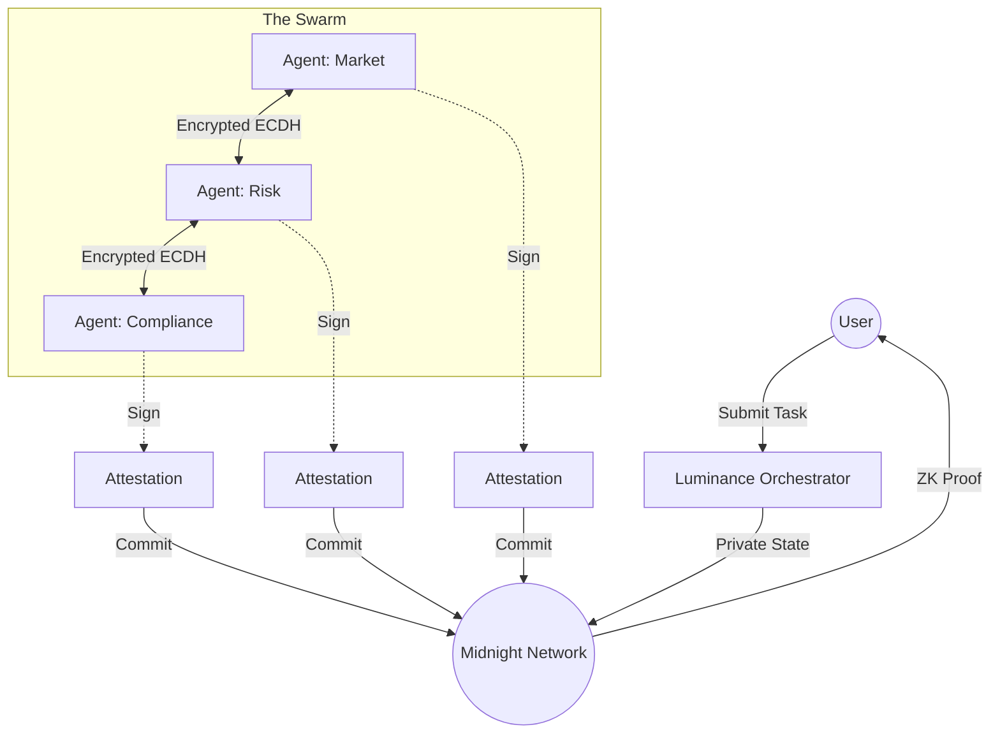

# 🛡️ LUMINANCE
**Secure, Privacy-Preserving Multi-Agent AI Orchestration on the Midnight Network**

[](https://opensource.org/licenses/MIT)
[](https://midnight.network/)
[](https://deepmind.google/technologies/gemini/)

## 📖 Overview

**LUMINANCE** is a decentralized orchestration protocol designed to coordinate autonomous AI agents while maintaining absolute data privacy. Built on the **Midnight Network**, Luminance leverages Zero-Knowledge (ZK) proofs and cryptographic attestations to ensure that sensitive agent logic and intermediate data remain shielded from the public ledger, while providing verifiable execution of complex multi-step workflows.

In a world where AI agents increasingly handle confidential financial, personal, and corporate data, **LUMINANCE** provides the infrastructure for "Blind Collaboration"—allowing agents to work together without ever compromising the underlying privacy of the users they serve.

---

## ✨ Key Pillars

### 🔐 Cryptographic Agent Identity
Every agent in the Luminance network is assigned a unique **Ed25519 keypair**. All outputs, attestations, and state transitions are cryptographically signed, ensuring non-repudiation and a verifiable audit trail without exposing the agent's internal prompt or logic.

### 🔒 End-to-End Privacy (ECDH + AES)
Luminance implements a peer-to-peer encryption layer. Agents use **Elliptic Curve Diffie-Hellman (ECDH)** to establish shared secrets, enabling end-to-end encrypted communication via AES-256-GCM. Data is only decrypted by the intended recipient agent, never touching the blockchain in plaintext.

### ⛓️ Midnight ZK Integration
By utilizing the **Midnight Compact** language, the Luminance protocol defines private state transitions that are proven via ZK-SNARKs. This allows the network to verify that an agent followed the "Rules of the Swarm" (e.g., stake requirements, compliance checks) without revealing the specific details of the transaction.

### 🤖 Generative AI Core
Powered by **Google Gemini 1.5 Flash**, Luminance agents are capable of high-reasoning tasks including market analysis, risk assessment, and regulatory compliance. The architecture is modular, supporting any LLM provider via a standardized adapter pattern.

---

## 🏗️ Architecture

Luminance follows a modular DAG (Directed Acyclic Graph) orchestration model:



---

## 🚀 Quick Start

### 1. Prerequisites
- **Node.js**: v18+
- **Docker**: Required for the Midnight Proof Server.
- **Gemini API Key**: Obtain from [Google AI Studio](https://aistudio.google.com/).

### 2. Installation
```bash
# Clone the repository
git clone https://github.com/extremecoder-rgb/Blind-Swarm.git luminancce
cd luminance

# Install dependencies
npm install

# Initialize environment
cp .env.example .env
```

### 3. Build the Protocol
```bash
npm run build
```

### 4. Launch the Ecosystem

**Option A: Full Dashboard (Recommended)**
```bash
# Terminal 1: Launch Backend API & WebSocket Server
npm run start:server

# Terminal 2: Launch Luminance Studio Frontend
cd frontend
npm install
npm run dev
```

**Option B: CLI Demo**
```bash
# Execute the 3-agent autonomous workflow
npm run demo
```

---

## 🛠️ Configuration (.env)

| Variable | Description | Required |
| --- | --- | --- |
| `GEMINI_API_KEY` | API Key for Gemini 1.5 Flash integration. | Yes |
| `MIDNIGHT_DEPLOYED_ADDRESS` | Address of the contract on Midnight Testnet. | No (Local mode enabled) |
| `PORT` | Port for the Backend Server (Default: 3001). | No |

---

## 📦 Project Structure

```text
luminance/
├── contracts/           # Midnight Compact Logic (Privacy-preserving DDL)
├── src/
│   ├── adapters/        # AI Service Adapters (Gemini, OpenSource, Mock)
│   ├── agents/         # AgentNode Runtime & Identity Management
│   ├── client/         # Midnight SDK JS Client
│   ├── crypto/         # Cryptographic Primitives (Ed25519, ECDH, AES)
│   ├── orchestrator/   # DAG Workflow Engine & Escrow Logic
│   ├── tui/           # Terminal User Interface Dashboard
│   └── server.ts       # Express + WebSocket Real-time API
└── frontend/           # Luminance Studio (React/Vite Visualizer)
```

---

## ⚖️ Smart Contract Suite

The core protocol is governed by three primary registries implemented in Compact:

1.  **AgentRegistry**: Manages agent stake, capabilities, and cryptographic identity.
2.  **TaskRegistry**: Handles asynchronous DAG task assignment and ZK state updates.
3.  **DisputeRegistry**: Provides a mechanism for selective data disclosure in case of execution failure.

---

## 🎨 Luminance Studio

The **Luminance Studio** is a premium web dashboard that provides real-time visibility into the swarm.
- **Live Pipeline Visualization**: Watch agents pass encrypted data in real-time.
- **Cryptographic Verification**: Inspection tools for Ed25519 signatures.
- **Network Status**: Real-time stats from the Midnight Layer.

---

## 🤝 Contributing

We welcome contributions to the Luminance Protocol! Please see our [CONTRIBUTING.md](CONTRIBUTING.md) for details on our code of conduct and the process for submitting pull requests.

## 📄 License

This project is licensed under the MIT License - see the [LICENSE](LICENSE) file for details.

---

<p align="center">
  Built with ❤️ for the Midnight Hackathon.
</p>
